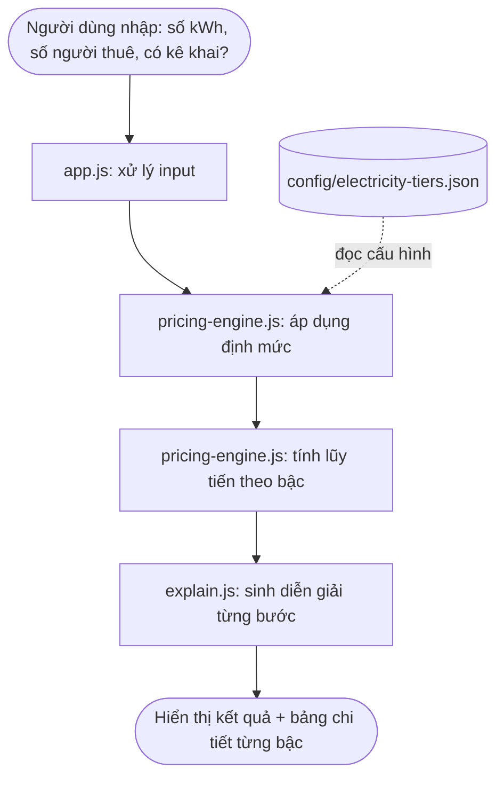

<div align="center">

# Open Cost Transparency — Minh bạch chi phí điện nước nhà trọ

[](./LICENSE)
[](https://github.com/aixuan181105/open-cost-transparency/releases)
[](https://github.com/aixuan181105/open-cost-transparency/issues)

**Công cụ nguồn mở giúp người thuê trọ tự tính và đối chiếu tiền điện, tiền nước hằng tháng theo đúng biểu giá bậc thang và định mức pháp luật hiện hành.**

[Xem demo](#-usage--demo) · [Báo lỗi](https://github.com/aixuan181105/open-cost-transparency/issues) · [Đóng góp](#-contributing)

</div>

---
## 📌 Giới thiệu

Nhiều cơ sở cho thuê trọ thu tiền điện theo đơn giá phẳng cố định (4.000–4.500đ/kWh), cao hơn cả bậc giá cao nhất trong biểu giá điện sinh hoạt hiện hành, trong khi người thuê không có công cụ nào để tự đối chiếu số tiền phải trả là đúng hay sai.

**Open Cost Transparency** là phần mềm nguồn mở, cài đặt đúng theo:

- Biểu giá bán lẻ điện sinh hoạt bậc thang lũy tiến (Quyết định 1279/QĐ-BCT, 09/05/2025)
- Quy tắc nhân định mức theo số người thuê (Thông tư 60/2025/TT-BCT)
- Trường hợp không kê khai số người → áp giá bậc 3 (theo đúng Thông tư 60/2025/TT-BCT)

để người thuê trọ **tự nhập số điện, tự xem kết quả tính toán từng bước**, đối chiếu với hóa đơn thực tế mà không phải tin vào một con số duy nhất do chủ trọ đưa ra.

> ⚠️ **Miễn trừ trách nhiệm**: Đây là công cụ tham khảo, không thay thế hóa đơn chính thức của đơn vị bán điện.

---

## 📑 Mục lục

- [Giới thiệu](#-giới-thiệu)
- [Tính năng](#-tính-năng)
- [Công nghệ sử dụng](#-công-nghệ-sử-dụng)
- [Kiến trúc](#-kiến-trúc)
- [Yêu cầu trước khi cài đặt](#-yêu-cầu-trước-khi-cài-đặt)
- [Hướng dẫn cài đặt / chạy từ mã nguồn](#-hướng-dẫn-cài-đặt--chạy-từ-mã-nguồn)
- [Cách sử dụng / Demo](#-usage--demo)
- [Cấu trúc thư mục](#-cấu-trúc-thư-mục)
- [Kiểm thử](#-kiểm-thử)
- [Đóng góp](#-contributing)
- [Ghi nhận lỗi](#-ghi-nhận-lỗi--bug-tracker)
- [Lịch sử thay đổi](#-lịch-sử-thay-đổi)
- [Giấy phép](#-giấy-phép)

---
## ✨ Tính năng

**Tính tiền điện**
- [x] Lũy tiến 6 bậc, cộng dồn đúng từng bậc (không nhân đơn giá phẳng)
- [x] Tự tính định mức theo số người thuê, nhân ngưỡng từng bậc theo định mức
- [x] Xử lý trường hợp không kê khai đủ số người → áp giá cố định bậc 3
- [x] Chọn đúng biểu giá và thuế suất theo **kỳ tính tiền** người dùng nhập

**Tính tiền nước**
- [x] Lũy tiến theo định mức m³/người/tháng, cộng phí bảo vệ môi trường và thuế GTGT nước sạch
- [x] Hỗ trợ cả ba phương thức thu thực tế: theo m³ có định mức, giá phẳng, khoán đầu người
- [x] Thêm địa phương mới bằng cách thêm dữ liệu vào JSON, không sửa code

**Minh bạch & đối chiếu**
- [x] Diễn giải từng bước có đánh số, giải thích *vì sao* ra con số đó
- [x] Bảng phân bổ đầy đủ các bậc, làm mờ những bậc **không** bị tính để người dùng thấy rõ
- [x] Đối chiếu số tiền chủ trọ đang thu với số tiền theo quy định, cảnh báo kèm căn cứ xử phạt
- [x] Tab tra cứu căn cứ pháp lý, sinh trực tiếp từ file cấu hình
- [x] Sao chép bản đối chiếu dạng văn bản / in ra PDF để làm việc với chủ trọ
- [x] Tab chạy kiểm thử ngay trên giao diện

## 🛠 Công nghệ sử dụng

| Thành phần | Công nghệ | Ghi chú |
| --- | --- | --- |
| Giao diện | HTML5, CSS3 thuần, JavaScript ES6 | Không build tool, không CDN, không web font — chạy được cả khi mất mạng |
| Icon | SVG viết trực tiếp trong HTML | Không dùng icon font/thư viện icon |
| Logic tính toán | JavaScript thuần (`src/pricing-engine.js`) | Không phụ thuộc DOM, chạy được trong Node.js |
| Cấu hình quy tắc | JSON (`config/*.json`) | Biểu giá, ngưỡng bậc, thuế suất, định mức, giá nước theo tỉnh |
| Kiểm thử | Node.js thuần (không framework) | `npm test` hoặc `node tests/pricing-engine.test.js` |

**Dependency bên ngoài: không có.** Dự án không cài bất kỳ gói npm nào (`node_modules` trống), không nhúng mã nguồn thư viện của dự án khác, không chỉnh sửa mã nguồn thư viện nào. `npx serve` chỉ là tuỳ chọn để chạy máy chủ tĩnh cục bộ, không phải dependency của sản phẩm.

Lý do chọn zero-dependency: tránh rủi ro mất mạng khi trình diễn trực tuyến, và loại bỏ hoàn toàn các điểm trừ PoF liên quan tới bundling và biên dịch bằng công cụ nguồn đóng.

---

## 🏗 Kiến trúc



Nguyên tắc thiết kế cốt lõi: **`pricing-engine.js` không phụ thuộc DOM/giao diện**, chỉ nhận input thuần và trả về kết quả + diễn giải — cho phép kiểm thử độc lập và tái sử dụng cho các bài toán tương tự (tiền nước, phí dịch vụ...).

---

## ✅ Yêu cầu trước khi cài đặt

- [Trình duyệt hiện đại bất kỳ (Chrome, Firefox, Edge...)]
- [Node.js phiên bản >= X, nếu dùng để chạy test hoặc dev server]
- [Git]

---

## 📥 Hướng dẫn cài đặt / chạy từ mã nguồn

```bash
# 1. Tải mã nguồn về
git clone https://github.com/aixuan181105/open-cost-transparency.git
cd open-cost-transparency

# 2. Chạy kiểm thử lõi tính toán (không cần cài gì thêm)
node tests/pricing-engine.test.js
# hoặc:  npm test

# 3. Chạy ứng dụng — CẦN một máy chủ tĩnh vì trình duyệt chặn fetch() qua file://
npx --yes serve . -l 3000
# hoặc:  python3 -m http.server 3000
# rồi mở http://localhost:3000
```

> **Lưu ý quan trọng:** mở trực tiếp `index.html` bằng cách nhấp đúp sẽ khiến trình duyệt
> chặn việc đọc các tệp trong `config/` (chính sách CORS với giao thức `file://`), ứng dụng
> sẽ hiện thông báo lỗi cấu hình. Hãy chạy qua máy chủ tĩnh như trên. Đây là hệ quả trực tiếp
> của quyết định thiết kế "tách tham số khỏi mã nguồn" — cấu hình nằm ở tệp riêng nên phải
> được nạp qua HTTP.

---
## 🎬 Usage / Demo


<!-- Thay bằng ảnh chụp màn hình thật hoặc GIF quay lại thao tác -->

**Các bước sử dụng:**

1. Nhập số điện tiêu thụ trong kỳ (kWh)
2. Nhập số người thuê thực tế
3. Chọn "Có kê khai đầy đủ số người" hoặc "Không kê khai"
4. Nhấn **Tính tiền điện**
5. Xem bảng chi tiết: sản lượng mỗi bậc, đơn giá, thành tiền từng bậc, tổng cộng

**Ví dụ:**

| Đầu vào | Giá trị |
| --- | --- |
| Số điện tiêu thụ | [ví dụ: 250 kWh] |
| Số người thuê | [ví dụ: 3 người] |
| Kê khai đầy đủ | Có |

→ Kết quả: [điền kết quả tính tay đã đối chiếu, ví dụ: 587.400đ, chi tiết theo từng bậc...]

---

## 📁 Cấu trúc thư mục

```
open-cost-transparency/
├── index.html                     # Giao diện: 3 tab (tính toán / căn cứ pháp lý / kiểm thử)
├── style.css                      # CSS thuần, biến màu ở :root, có style cho in ấn
├── src/
│   ├── pricing-engine.js          # LÕI: lũy tiến bậc thang, định mức, nước, đối chiếu
│   ├── explain.js                 # Sinh diễn giải từng bước tiếng Việt
│   └── app.js                     # Điều khiển DOM, KHÔNG chứa công thức
├── config/
│   ├── electricity-tiers.json     # Biểu giá điện, có phiên bản theo ngày hiệu lực
│   ├── vat.json                   # Thuế GTGT điện/nước theo thời kỳ
│   ├── water-rates.json           # Giá nước theo địa phương, 3 phương thức thu
│   └── legal-references.json      # Văn bản tham chiếu, mức xử phạt
├── tests/
│   ├── test-cases.js              # Định nghĩa 22 ca kiểm thử (dùng chung)
│   └── pricing-engine.test.js     # Runner cho dòng lệnh
├── docs/
│   ├── DESIGN.md
│   └── screenshots/
├── .github/ISSUE_TEMPLATE/
├── CHANGELOG.md
├── LICENSE
├── README.md
└── package.json
```

---

## 🧪 Kiểm thử

```bash
npm test
```

22 ca kiểm thử, chia theo nhóm: định mức, lũy tiến bậc thang, trường hợp không kê khai,
thuế theo thời kỳ, dữ liệu vào không hợp lệ, tiền nước, đối chiếu mức thu. Trong đó có các
ca chốt chặn quan trọng:

- Kết quả lũy tiến **không được** trùng với cách nhân đơn giá phẳng.
- Tổng sản lượng phân bổ qua các bậc luôn bằng đúng sản lượng đầu vào (kiểm tra ở nhiều mốc, kể cả đúng ranh giới bậc và số lẻ).
- Định mức lẻ (3 người = 0,75 định mức) cho ngưỡng bậc 1 là 37,5 kWh — chống lỗi lệch một đơn vị.
- Phòng đông người phải trả ít hơn phòng ít người ở cùng sản lượng.
- Không kê khai luôn đắt hơn hoặc bằng có kê khai.

Cùng bộ test này chạy được trong tab **Kiểm thử** trên giao diện, dùng chung file
`tests/test-cases.js` để không có nguy cơ hai nơi kiểm thử hai bộ logic khác nhau.

---

## 🤝 Contributing

Đóng góp luôn được chào đón:

1. Fork repo này
2. Tạo nhánh mới: `git checkout -b feature/ten-tinh-nang`
3. Commit theo chuẩn [Conventional Commits](https://www.conventionalcommits.org/): `feat: `, `fix: `, `docs: `...
4. Mở Pull Request kèm mô tả rõ thay đổi

Khi quy định pháp luật về biểu giá/thuế thay đổi, vui lòng cập nhật ở thư mục `config/`, **không sửa logic trong `pricing-engine.js`**.

---
## 🐞 Ghi nhận lỗi / Bug tracker

Báo lỗi hoặc đề xuất tính năng tại: **[GitHub Issues](https://github.com/aixuan181105/open-cost-transparency/issues)**

Khi báo lỗi, vui lòng mô tả: đầu vào đã nhập, kết quả nhận được, kết quả mong đợi.

---

## 📝 Lịch sử thay đổi

Xem chi tiết tại [CHANGELOG.md](./CHANGELOG.md).

---

## 📄 Giấy phép

Dự án được phát hành theo giấy phép **[MIT](./LICENSE)**.

Giấy phép đầy đủ tại: [LICENSE](./LICENSE)

---

## 🚀 Bản phát hành (Release)

Xem các phiên bản đã phát hành tại [Releases](https://github.com/aixuan181105/open-cost-transparency/releases).

Phiên bản dự thi: **v[1.0.0]** — release ngày [12/09/2026], commit: `9a5ef7e`

---

<div align="center">

Dự án được thực hiện cho kỳ thi tuyển đội tuyển Phần mềm nguồn mở 2026.

</div>
